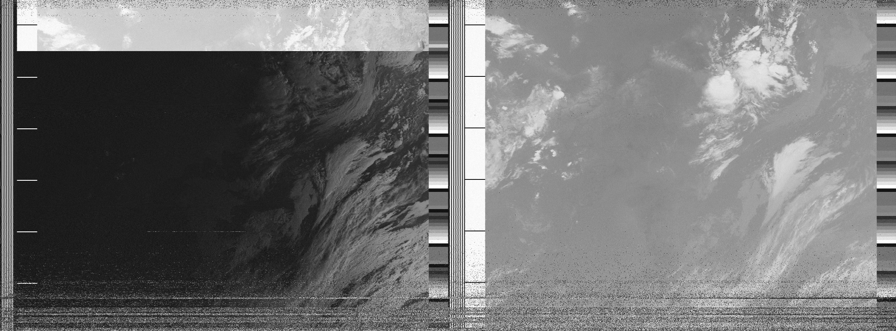
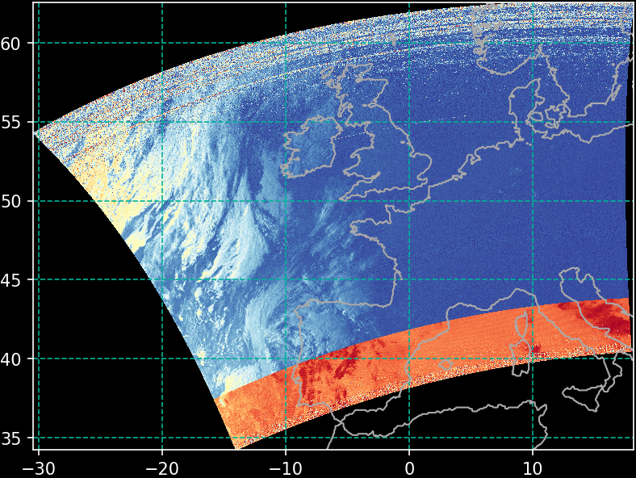
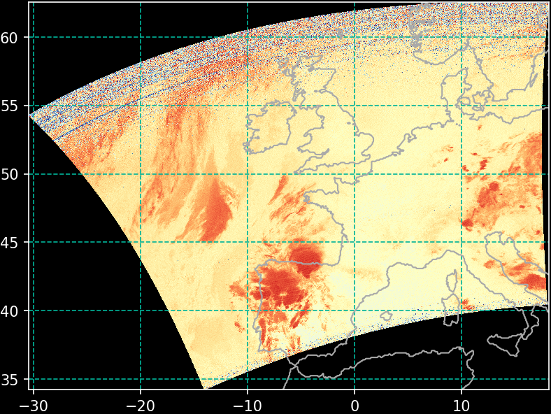

# Decoder for the Automatic Picture Transmission protocol

[](https://travis-ci.org/Alexander-Barth/APTDecoder.jl)
[](https://coveralls.io/github/Alexander-Barth/APTDecoder.jl?branch=master)
[](http://codecov.io/github/Alexander-Barth/APTDecoder.jl?branch=master)
[](https://alexander-barth.github.io/APTDecoder.jl/latest/)


All you need is a (relatively inexpensive) software-defined radio and antenna for 137 MHz (following for example these instructions [instructions](https://www.instructables.com/id/NOAA-Satellite-Signals-with-a-PVC-QFH-Antenna-and-/));

Record the signal using a software like GQRX (https://noaa-apt.mbernardi.com.ar/guide.html). 


## Install

* Install [Julia](https://julialang.org/downloads/)
* Launch julia and run:

```julia
import Pkg
Pkg.develop(PackageSpec(url="https://github.com/Alexander-Barth/APTDecoder.jl"))
```

* Make plots of a decoded and georefenced data stream with the following Julia command:

```julia
import APTDecoder
APTDecoder.makeplots("gqrx_20190825_182745_137620000.wav","NOAA 15")
```

This produces the following images:




This is the raw data. Channel a is on the left and channel b on the right. Note that channel a is just switching the wave-length during the capture. In part of Europe the sun went already down.






